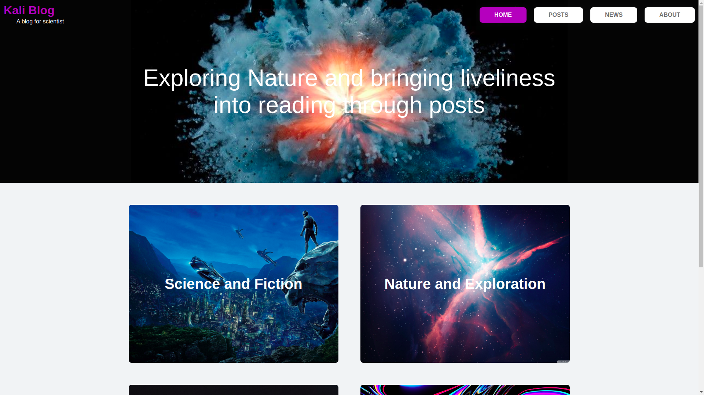
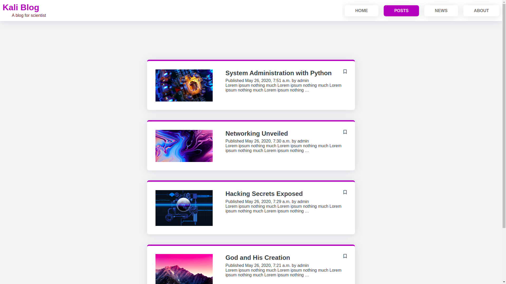

<h3 align="center">Kali Blog</h3>

<p align="center">
    This is a simple Blog build entire with HTML, CSS and Javascript as the
    frontend and Python (Django) as the backend
</p>

## Table of Contents

- [Introduction](#introduction)
- [Requirements](#requirements)
- [Installation](#installation)
- [Running](#running)


## Introduction

This project is a basic project and there's no much involvement when it
comes to installation.
A basic implementation of an authentication system including a login/logout
user registration, reset and change password.
There are two(2) separate apps;  
- authentication
- blog

The Authentication app is everything related to authentication is done.  
The Blog app also handles operations related to blog posts, comments, 
tagging, etc and many more features implemented by a minimum blogging system.


## Requirements
Since this project is a minimum blog project, there no many dependencies
either than the few listed below.
- Python 3.8 and above
- Django 2.2 and above
- Djangorestframework 2 and above

##### Note:
The specific versions of the dependencies are located in the requirements.txt file

Django and Djangorestframework come with their own dependencies which are
independent of the dependencies related to this project.
A listing of the dependencies are found in the requirements.txt located
in the root of the project.


## Installation

1. Clone this project
2. Install the dependencies in the requirements.txt file
3. Run your migrations
4. Run your fixtures 
5. Run the app

The above procedure is demonstrated in the snippet below
```shell script
user$ git clone https://kali-physi-hacker/KaliBlog.git 
user$ cd KaliBlog
user$ pip install -r requirements.txt
user$ python manage.py migrate
user$ python manaage.py loaddata users.json && python manage.py loaddata posts_category.json
```


## Running 
Run your app using Django's development server with the code below
```shell script
user$ python manage.py runserver
```
**View The App In Your Preferred Browser**


## NOTE:
The same set of terminal codes are used on all the platforms:
- Linux
- Windows
- Mac